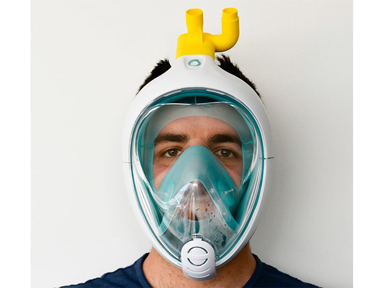

---
title: Scuba mask lifesaver
description: > 
    A reusable full face mask for use by medical staff in operating rooms and intensive care units has been developed by a team of anesthesiologists from the Haaglanden Medical Centre (HMC) in the Netherlands, in co-operation with engineers at Delft University of Technology.
      
keywords:
  - covid-19
  - medical equipment
  - mask
  - scuba mask
  - filter
  - patient 
  - recovery 
  - critical 
  - intensive care 
  - equipment 
  - emergency 
  - emt 
  - treatment 
  - hospital
  - operating room
project-link: https://www.covidlifesavermask.com/
made: true
intended-use: >-
    tbd
made-independently: false
license:
  hardware: undefined
okh-manifest-version: 1.0.0
date-updated: undefined
version: v.1.0.0
manifest-author:
  name: Jan 
  affiliation: 
    - TU Delft
    - Haaglanden Medical Centre (HMC)
contributors:
  - Jerry de vos
  - Another name
  - 
sub-parts:
  - Filter of certain type
  - undefined
location:
  - Netherlands, Delft
---
# Getting started
Document here - Summary of Delft Scuba Mask.

We'll put in one illustration just to prove how this should be set up:  images in the Readme should path to the /docs/img folder where they normally reside. This keeps the top of the design repo clean:  just Readme.md, and summary.jpg, which is for the app Finder to present on searches.

*CPAP Front View*

This is apparently the official way to do Figure Captions, for reference.

A short article, to be replaced by the real summary as it emerges..gitignore

